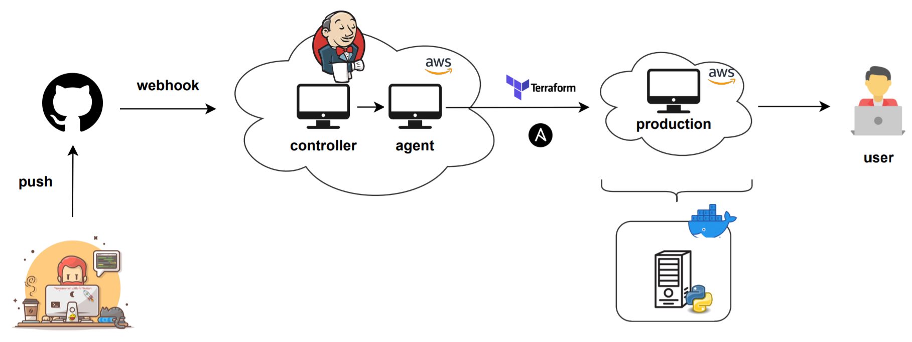

# Python Web Server

DevOps Summer program 2021, external course - final project - CI/CD pipeline.

This repo contains a Python web server and all necessary files to run it in AWS. 

---

### Architecture

First, Terraform launches two configured EC2 instances called Jenkins controller and Jenkins agent. As soon as changes were pushed to the repo, controller runs a pipeline using agent. Pipeline creates a target server (if it is not exist) using Terraform, pulls the Github project, tests the web server and configures target server using Ansible. Ansible copies source files and runs the web server in Docker container.

It is possible to watch the content of the web page from your web browser.

| command | result  |
|---|---|
| [server's IP address]:8888 | index.html  |
| [server's IP address]:8888/index.html | index.html  |
| [server's IP address]:8888/github.png | github.png  |
| [server's IP address]:8888/background2.jpg | background2.jpg |
| else | 404 error  |

Web server uses 8888 port.

---

### Launch instruction
To run the project:
- Launch two Amazon EC2 instances from Terraform files located in **./infrastructure/jenkins_controller**. Don't forget to change key name in **./infrastructure/jenkins_controller/variables.tf**.
- Sign up to the Jenkins controller from your web browser.
- Connect agent to the controller. Use **ubuntu20** as a label. In this project it is used the same key to connect the Jenkins agent and Target server and it is used by different tools, so you need to call it **pem-key**.
- Install **terraform** and **ansible** plugins. Configure them. For terraform: use **terraform** as name and select default installer. For ansible: **use ansible2** as name and set path to **/usr/bin/**.
- Create Jenkins pipeline in Jenkins controller.
- Configure it:
  - Add GitHub project's URL and enable GitHub hook trigger for GITScm polling.
  - Add **./infrastructure/jenkins/Jenkinsfile** as a pipeline script. 
- Create webhook in your Github repository's settings. 

Also you need to have a **terraform-jenkins-role** in your AWS account with EC2 administrator access.
